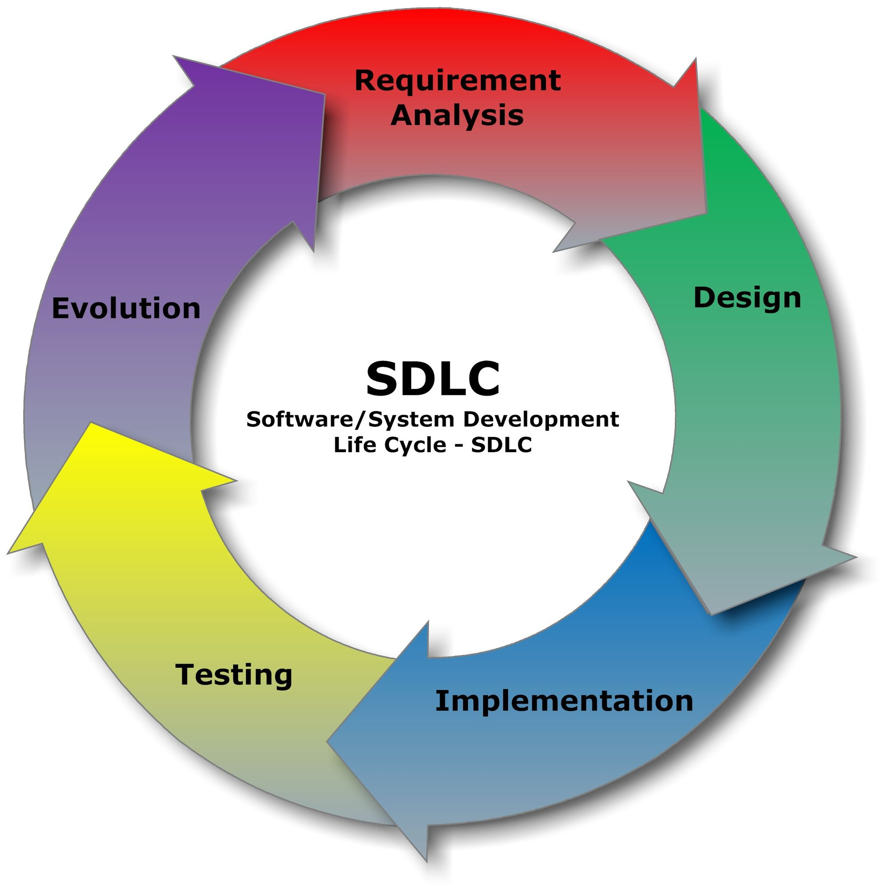
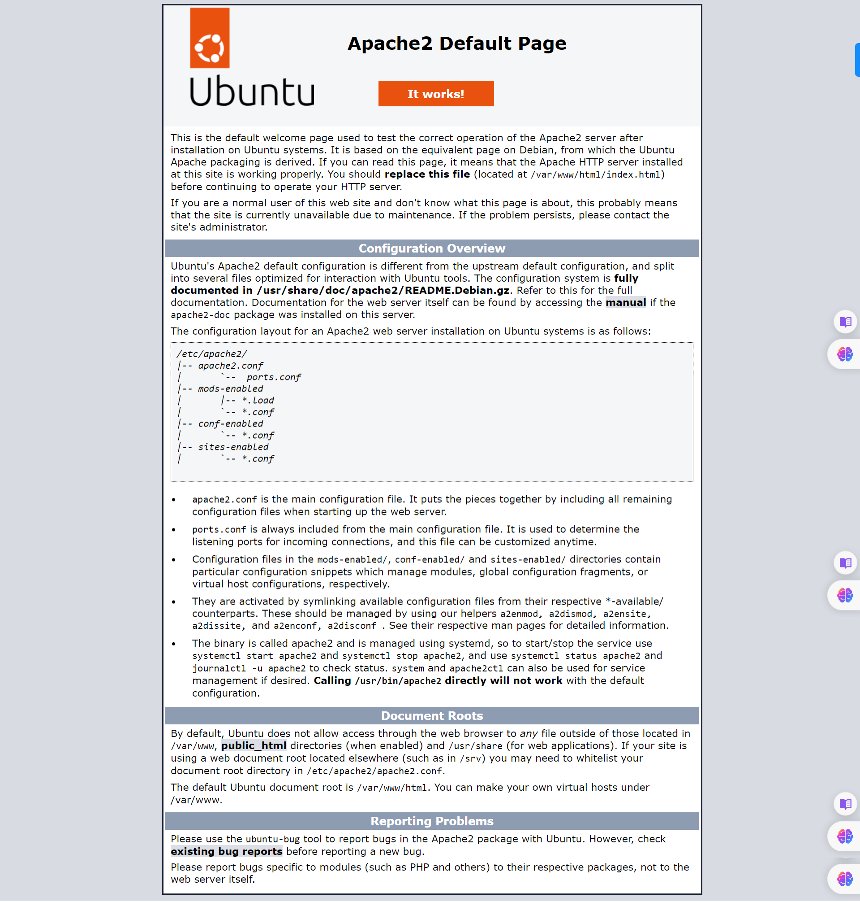

# Introduction to DevOps

## What is DevOps?

DevOps is the intersection between the developers and operations.

This is how I installed Git on my windows.

- First I download git online
- Secondly I run the installation and follow the prompt.

[How to download Git on windows](https://git-scm.com/downloads)


# ASSIGNMENT - 1

Create a comprehensive documentation on the following subject matter

## The Concept of DevOps?

> What is DevOps?

In simple terms, Devops is a culture or practice which fills the gap between development team and the operations team.

In a wider context, DevOps is a software development methodology that integrates and automates processes between development and IT teams through a combination of cultural philosophies, tools and practices for the continuous integration and delivery of applications at a faster and more efficient rate.

> Benefits of DevOps

Successful DevOps adoption drives faster, more dependable software deployment and delivery,
increased operational efficiency and reduced security and compliance risks.

The benefits can be divided into 2 broad categories:

Technical benefits:

- Continuous software delivery
- Less complex problems to fix
- Faster resolution of problems

Business benefits:

- Faster delivery of features
- More stable operating environments
- More time available to add value (rather than fix/maintain)

> History of DevOps

The History of DevOps can be traced back to around 2007. Software developers voiced a need for a more streamlined and efficient software development model. The traditional software model, where developers who wrote code worked apart from operations who deployed and supported the code, supported siloed processes, which resulted in bottlenecks and delays. Under the traditional software development model, security was an afterthought rather than a vital step in the development process. Security breaches were dealt with after they had already taken place, as opposed to preventing them from happening in the first place. With the old software development model proving to be ineffective and the need for speed and a stronger focus on security, With the advent of DevOps, there was a fostering a shared responsibility and collaborative work culture, breaking down the traditional silos between development and operations teams. This seamless communication and collaboration lead to higher efficiency and productivity..

> DevOps Culture

DevOps encourages the culture of shared responsibility, collaboration and continuous improvement.

### SDLC (Software Development LifeCycle)

> The Concept of SDLC

SDLC stands for Software Development Life Cycle.
The concept of Software Development Life Cycle (SDLC) refers to the process of planning, developing, testing, and deploying software applications. It is a structured approach that aims to produce high-quality software that meets the demands of users.

> Why is it important for a DevOps Engineer?

SDLC involves the following phases: Planning, Designing, Building, Testing, Deploying and maintaining afterwards.

Having a clear Understanding of each phase of SDLC is important for DevOps Engineers as it provides a holistic view of the software development process. By doing so, It will help developers and operations teams work to improve collaboration, optimize processes, and ultimately, deliver better software applications.

> Where does DevOps fit in SDLC ?

DevOps fit into the Designing, Building, Testing, Deploying and maintenance phase of the SDLC.

> Can DevOps improve the SDLC Process?

DevOps can improve SDLC process through Automation and Orchestration.

Automation refers to the use of automated processes to reduce manual effort and speed up the delivery of services. It will in turn helps to streamline the software development process by automating mundane tasks like code reviews and deployment processes.

Orchestration breaks down complex tasks into simpler ones that are easier to manage.

The combination of Automation and Orchestration will improve SDLC by reducing manual intervention required from dev teams and allows them to focus on developing higher-quality code in less time,

As well as enabling dev teams to deploy applications quickly and reliably in various environments, such as staging or production.

> Image of SDLC.



## Introduction to Operating Systems

### What is an Operating System?

An OS is a translator between the programs that runs on our computer and the hardwares that the computer is made up of. It manages a fair usage of resources among the applications that runs on our computer, such as memory allocations. It isolates the content of applications, so that they don't interfere with each others resources.

> Tasks of an Operating System

1. Resource allocation and Management.

   - The CPU handles the Process Management through activity monitoring, allocating a CPU to each process running on the computer.

   - `What is a process?`: This is a small unit that executes on a computer, e.g. is the opening a CLI, opening of a new tab.
   - Each `Process` has it's own isolated `Space` for it's execution so as not to interfere with other processes running on the computer.

2. Processor Management

3. Device Management

4. File Management

5. User Interface or Command Interpreter

6. Booting the Computer

7. Security

> Components of an Operating System

a. Process management
b. Files management
c. Command Interpreter
d. System calls
e. Signals
f. Network management
g. Security management
h. I/O device management
i. Secondary storage management
j. Main memory management

> Types of Operating Systems

- Windows

- Ubuntu

- Mac Operating system.

> Linux Operating System

## Introduction to Virtualization and Virtual Machines

### What is a Server?

`A Server is a program or a device that provides functionality for called clients which are other programs or devices`.

### The concept of Virtualization

`Virtualization uses software called hypervisors to create multiple virtual computers (known as virtual machines or VMs) on a single physical machine. These virtual machines can access all the parts of the physical machine, including the computer’s brain or processors, memory and storage`.

`Each virtual machine runs on its own operating system and functions like a completely separate machine—even though it’s sharing the resources of one physical computer`.

### What is a Virtual Machine?

`A virtual machine is a software-based emulation of a physical computer. It allows you to run multiple operating systems on a single physical machine, making it easier to manage and utilize hardware resources efficiently`.

### What is a hypervisor?

`A hypervisor is a software that creates and runs virtual machines (VMs) on a physical host machine. It allows multiple operating systems to run on a single physical machine, effectively partitioning the resources of the host machine between the VMs`.

### Physical Machine vs Virtual Machine

`A physical machine refers to a physical server or computer that runs an operating system directly on its hardware, while a virtual machine refers to a software-based emulation of a physical computer that runs on a physical machine`.

`Virtual machines allow for better resource utilization, easier migration, and isolation of applications, while physical machines offer better performance for certain applications and may be more secure in some cases`.

## LAMP PROJECT

The aim of this project is to deploy a LAMP project on EC2 instance.

Reference [material](https://www.digitalocean.com/community/tutorials/how-to-install-lamp-stack-on-ubuntu)

### STEPS

> Create AWS account and launch EC2 instance.
> Add rules and permissions
> Connect to the EC2 instance to work with the CLI.

### How To Install Linux, Apache, MySQL, PHP (LAMP) Stack on Ubuntu

> Update the package manager cache

`sudo apt update`.

> Install apache

`sudo apt install apache2`

> Once the installation is finished, you’ll need to adjust your firewall settings to allow HTTP traffic.

`sudo ufw app list`

You'll see the below in your terminal if your installation went well:

```
Available applications:
  Apache
  Apache Full
  Apache Secure
  OpenSSH
ubuntu@ip-172-31-45-105:~$
```

> Next run `sudo ufw allow in "Apache"` - To only allow traffic on port `80`.

> Run `sudo ufw status` to verify the change.
> Run `sudo systemctl status apache2` to check system is running and active as below:

```
ubuntu@ip-172-31-45-105:~$ sudo systemctl status apache2
● apache2.service - The Apache HTTP Server
     Loaded: loaded (/lib/systemd/system/apache2.service; enabled; vendor preset: enabled)
     Active: active (running) since Thu 2024-02-29 19:53:01 UTC; 18min ago
       Docs: https://httpd.apache.org/docs/2.4/
   Main PID: 2625 (apache2)
      Tasks: 55 (limit: 1121)
     Memory: 4.9M
        CPU: 85ms
     CGroup: /system.slice/apache2.service
             ├─2625 /usr/sbin/apache2 -k start
             ├─2627 /usr/sbin/apache2 -k start
             └─2628 /usr/sbin/apache2 -k start

Feb 29 19:53:01 ip-172-31-45-105 systemd[1]: Starting The Apache HTTP Server...
Feb 29 19:53:01 ip-172-31-45-105 systemd[1]: Started The Apache HTTP Server.

```

> Apache up and running Image.



### Step 2 — Installing MySQL

> Run `sudo apt install mysql-server`

> Run `sudo systemctl status mysql` to confirm mysql is running.
> Run `sudo mysql` to open the MySQL prompt.
> Run `ALTER USER 'root'@'localhost' IDENTIFIED WITH mysql_native_password BY 'password';` command to change the root user’s authentication method to one that uses a password. Then exit the prompt with `exit` command.

### Step 3 — Installing PHP

> Run `sudo apt install php libapache2-mod-php php-mysql`
> To Check version; run `php -v` to confirm installation.

```
ubuntu@ip-172-31-45-105:~$ php -v
PHP 8.1.2-1ubuntu2.14 (cli) (built: Aug 18 2023 11:41:11) (NTS)
Copyright (c) The PHP Group
Zend Engine v4.1.2, Copyright (c) Zend Technologies
    with Zend OPcache v8.1.2-1ubuntu2.14, Copyright (c), by Zend Technologies
```

### Step 4 — Creating a Virtual Host for your Website

Run `sudo mkdir /var/www/your_domain`

> The website deployed.


### Step 5 — Testing PHP Processing on your Web Server

create a PHP test script to confirm that Apache is able to handle and process requests for PHP files.

Create a new file named info.php inside your custom web root folder:

> Run `nano /var/www/your_domain/info.php`
>
> info.php page.


