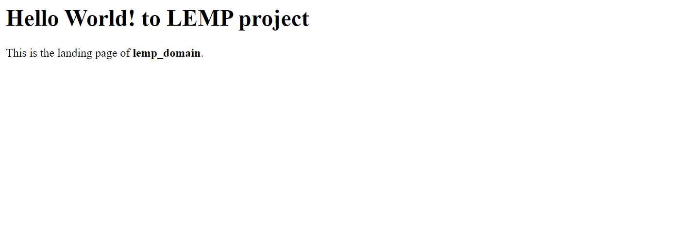

# How To Install Linux, Nginx, MySQL, PHP (LEMP stack) on Ubuntu 22.04

[Reference material](https://www.digitalocean.com/community/tutorials/how-to-install-linux-nginx-mysql-php-lemp-stack-on-ubuntu-22-04)

The LEMP software stack is a group of software that can be used to serve dynamic web pages and web applications written in PHP. This is an acronym that describes a Linux operating system, with an Nginx (pronounced like “Engine-X”) web server. The backend data is stored in the MySQL database and the dynamic processing is handled by PHP.

- Create AWS account and launch EC2 instance.

- Add rules and permissions.

- Connect to the EC2 instance to work with the CLI.

## Step 1 – Installing the Nginx Web Server

Run `sudo apt install nginx` to install `Nginx`

> You will need to allow connections to Nginx
>
> Run `sudo ufw app list`.

You'll see the below:

```
ubuntu@ip-172-31-35-17:~$ sudo ufw app list
Available applications:
  Nginx Full
  Nginx HTTP
  Nginx HTTPS
  OpenSSH
```

Since you haven’t configured SSL for your server in this guide, you will only need to allow regular HTTP traffic on port `80`. Enable this by running the following:

`sudo ufw allow 'Nginx HTTP'`

> Verify Nginx is running


## Step 2 — Installing MySQL

Run `sudo apt install mysql-server`

## Step 3 – Installing PHP

`sudo apt install php8.1-fpm php-mysql`

## Step 4 — Configuring Nginx to Use the PHP Processor

When using the Nginx web server, we can create server blocks (similar to virtual hosts in Apache)

`sudo mkdir /var/www/your_domain`

You can test your configuration for syntax errors by running the following:

`sudo nginx -t`

> reload Nginx to apply the changes:
>
> `sudo systemctl reload nginx`

> Page served by Nginx



## Step 5 –Testing PHP with Nginx

`nano /var/www/your_domain/info.php`


